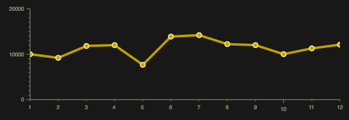
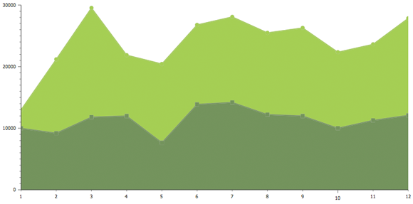
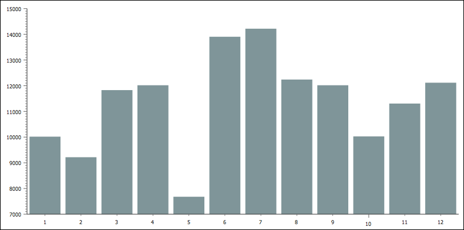
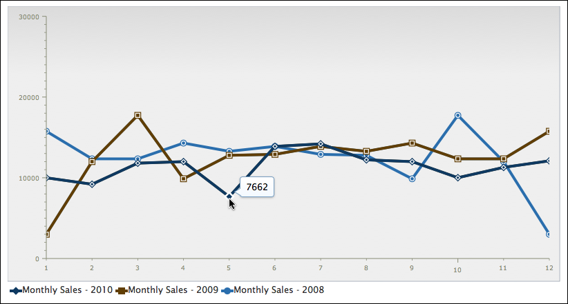
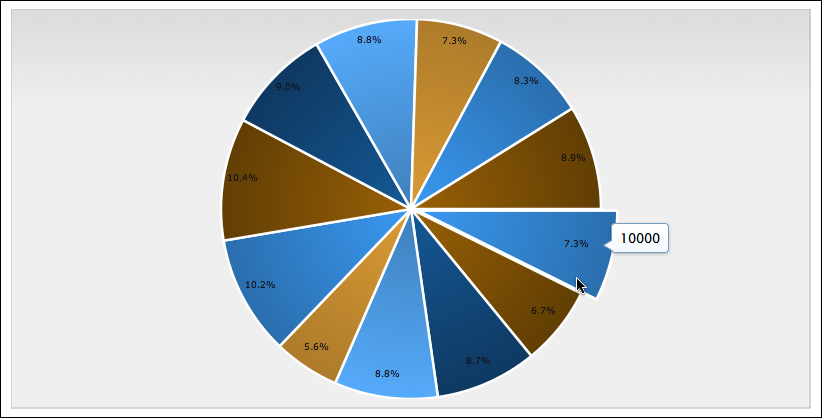
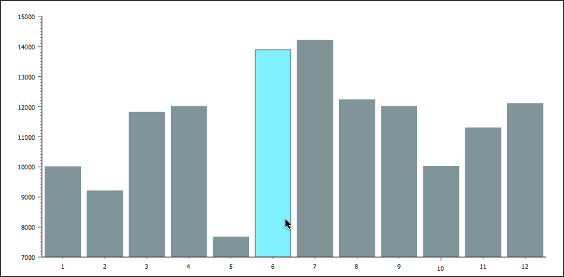

---
Category:  Widgets
...

## Charting

Presenting statistical data in a readable, eye-catching manner is important, but it can also be difficult. The `dojox/charting` system was created to alleviate those pains by allowing developers to create dynamic, unique, and functional charts from varying sets of data. In addition, `dojox/charting` provides numerous themes and chart types to allow developers to display their data any way they'd like. This tutorial will show you how to create basic charts with varying data, plots, axes, and themes.

### Getting Started

Dojo's charting library lives within the `dojox/charting` resource.  The `dojox/charting` collection is very unique in that it:

*   Allows charts to be created with HTML (declaratively) or with JavaScript (programmatically)
*   Works on almost all devices
*   Can render charts in SVG, VML, Silverlight, and Canvas.  An effort to allow SVGWeb rendering is also under way.
*   Allows for the developer to decide which renderer to use
*   Evaluates the client and uses an appropriate renderer based on what the client supports
*   Creates charts with [dojox/gfx](/reference-guide/1.10/dojox/gfx.html), a powerful vector graphic library capable of making your charts animate in a wide variety of ways
*   Comes packaged with dozens of attractive, diverse themes
*   Allows for linear and radial gradients within chart themes (and even works in Internet Explorer!)

### Configuring dojox/charting

Before creating these wonderful charts, it's important to make chart resources available within the page.

As with any Dojo Toolkit resource, use `require` to load dependencies.  Two dependencies that the developer will always need are the chart resource and the desired [theme](http://archive.dojotoolkit.org/nightly/dojotoolkit/dojox/charting/tests/theme_preview.html):

```js
require([
	 // Require the basic 2d chart resource
	"dojox/charting/Chart",

	// Require the theme of our choosing
	"dojox/charting/themes/Claro",

], function(Chart, theme){
	// ....
}
```

If a specific rendering priority is preferred, it may be added to the dojoConfig object that's created before loading Dojo:

```html
<script>
	dojoConfig = {
		parseOnLoad: true, //enables declarative chart creation
		gfxRenderer: "svg,silverlight,vml" // svg is first priority
	};
</script>
<script src="/path/to/dojo/dojo/dojo.js"></script>
```

Note that in 1.7+, the Chart2D "catch-all" module which loads all axis and plot types is deprecated. It is still available for use, but the preferred approach is to use Chart and include just the axis and plot modules you need.

With these minimal dependencies loaded, your application is now empowered to create charts!

### Creating a Basic Chart

#### Declaratively

There are two ways to create a basic chart:  declaratively and programmatically.  Before creating the chart, however, it's important to first create/access data.  The following data sample will be used for creating the basic chart:

```js
// x and y coordinates used for easy understanding of where they should display
// Data represents website visits over a week period
chartData = [
	{ x: 1, y: 19021 },
	{ x: 1, y: 12837 },
	{ x: 1, y: 12378 },
	{ x: 1, y: 21882 },
	{ x: 1, y: 17654 },
	{ x: 1, y: 15833 },
	{ x: 1, y: 16122 }
];
```

With data properly formatted and available, a chart created declaratively would look like:

```html
<!-- create the chart -->
<div
	data-dojo-type="dojox/charting/widget/Chart"
	data-dojo-props="theme:dojox.charting.themes.Claro" id="viewsChart" style="width: 550px; height: 550px;">

	<!-- Pie Chart: add the plot -->
	<div class="plot" name="default" type="Pie" radius="200" fontColor="#000" labelOffset="-20"></div>

	<!-- pieData is the data source -->
	<div class="series" name="Last Week&#x27;s Visits" array="chartData"></div>
</div>
```
[View Demo](demo/basic-declarative.html)

[](demo/basic-declarative.html)

*A pie chart using the Claro theme*

With declarative chart creation, the main chart settings go within the container node.  Plots and series get their own nodes with custom attributes containing chart settings, as would plugins and other chart pieces.

Important note:  while it's certainly possible to create charts declaratively, it's highly recommended that developers create them programmatically.  dojox/charting does not yet fully support the  `data-dojo` attributes introduced in Dojo 1.6+.

#### Programmatically

Programmatic chart creation requires a bit more code but provides more stability and control.  The same chart could be created programmatically with the following code:

```html
<script>
	require([
		 // load modules...
	], function(Chart, theme, PiePlot){

		// Create the chart within it&#x27;s "holding" node
		var pieChart = new Chart("chartNode");

		// Set the theme
		pieChart.setTheme(theme);

		// Add the only/default plot
		pieChart.addPlot("default", {
			type: PiePlot, // our plot2d/Pie module reference as type value
			radius: 200,
			fontColor: "black",
			labelOffset: -20
		});

		// Add the series of data
		pieChart.addSeries("January",chartData);

		// Render the chart!
		pieChart.render();

	});
</script>

<!-- create the chart -->
<div id="chartNode" style="width: 550px; height: 550px;"></div>
```
[View Demo](demo/basic-programmatic.html)

The code above should give you a basic example of `dojox/charting`, but there's much more to chart creation than that.  Let's dig deeper into `dojox/charting` and its capabilities.

### Chart Themes

The Dojo charting library provides numerous themes for developers to choose from.  Themes vary in visual complexity; some themes use solid hex colors while more complex chart themes use advanced logic to calculate linear and even radial gradients to enhance their look.  Themes can be found within the `dojox/charting/themes` resource.  Themes are simply one JavaScript file with theme-specific data.  The following is the code which creates the "Miami Nice" theme:

```js
define([
	// Require the SimpleTheme class which is used by all non-gradient based themes
	"../SimpleTheme",
	"./common"
], function(Theme, themes){

	themes.MiamiNice=new Theme({
		colors: [
			"#7f9599",
			"#45b8cc",
			"#8ecfb0",
			"#f8acac",
			"#cc4482"
		]
	});

	return themes.MiamiNice;
});
```

More complex themes are also available, by requiring `dojox/charting/themes/Theme`.  One example would be the "Claro" theme which uses gradients and customized font settings:

```js
define(["../Theme", "dojox/gfx/gradutils", "./common"], function(Theme, gradutils, themes){
	// created by Tom Trenka

	var g = Theme.generateGradient,
		defaultFill = {type: "linear", space: "shape", x1: 0, y1: 0, x2: 0, y2: 100};

	themes.Claro = new Theme({
		chart: {
			fill:	   {
				type: "linear",
				x1: 0, x2: 0, y1: 0, y2: 100,
				colors: [
					{ offset: 0, color: "#dbdbdb" },
					{ offset: 1, color: "#efefef" }
				]
			},
			stroke:    {color: "#b5bcc7"}
		},
		plotarea: {
			fill:	   {
				type: "linear",
				x1: 0, x2: 0, y1: 0, y2: 100,
				colors: [
					{ offset: 0, color: "#dbdbdb" },
					{ offset: 1, color: "#efefef" }
				]
			}
		},
		axis:{
			stroke:	{ // the axis itself
				color: "#888c76",
				width: 1
			},
			tick: {	// used as a foundation for all ticks
				color:     "#888c76",
				position:  "center",
				font:      "normal normal normal 7pt Verdana, Arial, sans-serif",	// labels on axis
				fontColor: "#888c76"								// color of labels
			}
		},
		series: {
			stroke:  {width: 2.5, color: "#fff"},
			outline: null,
			font: "normal normal normal 7pt Verdana, Arial, sans-serif",
			fontColor: "#131313"
		},
		marker: {
			stroke:  {width: 1.25, color: "#131313"},
			outline: {width: 1.25, color: "#131313"},
			font: "normal normal normal 8pt Verdana, Arial, sans-serif",
			fontColor: "#131313"
		},
		seriesThemes: [
			{fill: g(defaultFill, "#2a6ead", "#3a99f2")},
			{fill: g(defaultFill, "#613e04", "#996106")},
			{fill: g(defaultFill, "#0e3961", "#155896")},
			{fill: g(defaultFill, "#55aafa", "#3f7fba")},
			{fill: g(defaultFill, "#ad7b2a", "#db9b35")}
		],
		markerThemes: [
			{fill: "#2a6ead", stroke: {color: "#fff"}},
			{fill: "#613e04", stroke: {color: "#fff"}},
			{fill: "#0e3961", stroke: {color: "#fff"}},
			{fill: "#55aafa", stroke: {color: "#fff"}},
			{fill: "#ad7b2a", stroke: {color: "#fff"}}
		]
	});

	themes.Claro.next = function(elementType, mixin, doPost){
		var isLine = elementType == "line";
		if(isLine || elementType == "area"){
			// custom processing for lines: substitute colors
			var s = this.seriesThemes[this._current % this.seriesThemes.length],
				m = this.markerThemes[this._current % this.markerThemes.length];
			s.fill.space = "plot";
			if(isLine){
				s.stroke  = { width: 4, color: s.fill.colors[0].color};
			}
			m.outline = { width: 1.25, color: m.fill };
			var theme = Theme.prototype.next.apply(this, arguments);
			// cleanup
			delete s.outline;
			delete s.stroke;
			s.fill.space = "shape";
			return theme;
		}
		else if(elementType == "candlestick"){
			var s = this.seriesThemes[this._current % this.seriesThemes.length];
			s.fill.space = "plot";
			s.stroke  = { width: 1, color: s.fill.colors[0].color};
			var theme = Theme.prototype.next.apply(this, arguments);
			return theme;
		}
		return Theme.prototype.next.apply(this, arguments);
	};

	themes.Claro.post = function(theme, elementType){
		theme = Theme.prototype.post.apply(this, arguments);
		if((elementType == "slice" || elementType == "circle") &amp;&amp; theme.series.fill &amp;&amp; theme.series.fill.type == "radial"){
			theme.series.fill = gradutils.reverse(theme.series.fill);
		}
		return theme;
	};

	return themes.Claro;
});
```

Whether the theme you implement (or create) is basic or complex, implementing the theme within your chart couldn't be easier.  Simply require the resource and call "setTheme" on the chart:

```js
require([
	 // Require the basic 2d chart resource: Chart2D
	"dojox/charting/Chart",

	// Require the theme of our choosing
	"dojox/charting/themes/Claro",

], function(Chart, theme){

	// Create the chart within it&#x27;s "holding" node
	var pieChart = new Chart("chartNode");

	// Set the theme
	pieChart.setTheme(theme);

	// ...
});
```

You may use any number of themes on a given page.  Want to learn how to create a custom chart theme for your web application?  Read [Dojo Charting: Dive Into Theming](http://www.sitepen.com/blog/2012/11/09/dojo-charting-dive-into-theming/).

### Chart Components:  Plots, Axes, Series

Defining a basic chart and implementing its theme is quite simple.  The real work comes in when defining plots, axes, and series.  Each piece serves its own distinct, important purpose.

#### Plots

One of the main focuses of plots within `dojox/charting` is defining the type of chart to be added and providing values for the specific chart type's settings.  `dojox/charting` features numerous 2D charts including:

* **Default** - Universal line chart capable of rendering lines, fill areas under those lines, and placing markers at data points. This plot type is used if no plot type was specified when adding it to a chart.
* **Lines** - Basic line chart. Uses Default.
* **Areas** - Area under data line(s) will be filled. Uses Default.
* **Markers** - Lines with markers. Uses Default.
* **MarkersOnly** - Markers, sans lines. Uses Default.
* **Stacked** - Data sets charted in relation to the previous data set. Extension of Default.
* **StackedLines** - Stacked data sets using lines. Uses Stacked.
* **StackedAreas** - Stacked data sets with filled areas under chart lines. Uses Stacked.
* **Bars** - Horizontal bars.
* **ClusteredBars** - Horizontal bars with clustered data sets. Uses Bars.
* **StackedBars** - Stacked data sets with horizontal bars. Uses Bars.
* **Columns** - Vertical bars.
* **ClusteredColumns** - Vertical bars with clustered data sets. Uses Columns.
* **StackedColumns** - Stacked data sets with vertical bars. Uses Columns.
* **Pie** - The traditional pie chart.
* **Scatter** - Similar to MarkerOnly, yet capable of charting using gradient fields.

You can see each chart type in action by visiting [Dojo's nightly charting tests](http://archive.dojotoolkit.org/nightly/dojotoolkit/dojox/charting/tests/test_chart2d.html).

Plots are added to a chart with the chart's `addPlot` method, passing it the chart's name (usually "default") and plot-specific options:

```js
// Add the default plot
chart.addPlot("default",{
	// Add the chart type
	type: "Pie"
});
```

When using `dojox/charting/Chart`, you need to `require` each plot-type module you wish to use.

Some of the standard plot options include:

* **type** - The chart type (Pie, Bars, Scatter, etc.)
* **lines** - Represents if lines should be added within the chart
* **markers** - Represents if markers should be added to data points within the chart
* **areas** - Represents if areas within the chart should be shaded
* **shadows** - Represents if shadows should be added to lines within the plot (ex: `{dx:4, dy:4}`)
* **tension** - Adds curves to lines within plots for added smoothness. Values can be:
* **X** - Cubic bezier lines
* **x** - Similar to "X" but assumes that the point set is closed (a loop). It can be used when plotting true XY data.
* **S** - Quadratic bezier lines.
* **gap** - Represents the number of pixels between bars

Each chart type may have its own custom options.  The Pie plot type, for example, has a `radius` setting which defines the size of the chart's radius:

```js
// Add the default plot
chart.addPlot("default",{
	// Add the chart type
	type: "Pie",
	// Add the radius size because it's a pie chart
	radius: 200 //pixels
});
```

Before creating your chart, take the time to visit the [dojox/charting Reference Guide](/reference-guide/1.10/dojox/charting.html) to see what special settings and customizations are available for the chart type you'd prefer.

#### Axes

Most charts feature axes and many of those are the traditional `x` and `y` setup. An axis may be horizontal (the default) or vertical.  Axes are added to charts with `addAxis` method.  The following code snippet adds `x` and `y` axes to a chart:

```js
// Add the X axis
chart.addAxis("x");
// Ad the Y axis
chart.addAxis("y",{
	vertical: true // y is vertical!
});
```

You may also create custom axes on your chart:

```js
// Add a custom "dw" axis
chart.addAxis("dw",{
	vertical: true,
	leftBottom: false
});
```

Some of the standard axis options include:

* **fixUpper** - Aligns chart ticks (can be "major", "minor", "micro", and "none")
* **fixLower** - Aligns chart ticks (can be "major", "minor", "micro", and "none")
* **leftBottom** - Determines the side of the chart the axis is placed (default is `true`)
* **min** - The minimum number an axis can start at
* **max** - The maximum number an axis can end at

You can learn more about an [axis' settings including customization of colors, fonts, stepping, and precision](/reference-guide/1.10/dojox/charting.html#enabling-and-disabling-tick-marks) in the Dojo reference guide.

### Series

<p>This element is simply a series of data to be rendered to the chart.  A series is added to the chart with the `addSeries` method.  The `addSeries` method accepts three arguments:

* **name** - The name of the series.  Also represents the series label when the Legend plugin is used.
* **data** - The array of data
* **options** An object containing series options, which may include:
* **stroke** - Color and width of lines (ex: `{ color:"red", width: 2 }`)
* **fill** - Fill color of bar / line / pie piece

Adding a series can be as easy as:

```js
// Add a simple axis to the chart
chart.addSeries("Visits",[10,20,30,40,50],{
	stroke: {
		color: "blue",
		width: 3
	},
	fill: "#123456"
});
```

A multi-axes series of data would look like:

```js
// Add a multi-axes data series to the chart
chart.addSeries("Visits",[
	{ x: 1, y: 200 },
	{ x: 2, y: 185 },
	// and so on...
],{
	stroke: {
		color: "blue",
		width: 3
	},
	fill: "#123456"
});
```

A chart can have any number of overlapping series as the developer would like.

### dojox/charting Examples

With the pieces of `dojox/charting` defined, it's time to create some basic charts.

#### Line Chart:  Monthly Sales

The Monthly Sales chart is a lines chart which features multiple axes and the "Tom" theme.

```html
<script>
require([
	 // Require the basic chart class
	"dojox/charting/Chart",

	// Require the theme of our choosing
	"dojox/charting/themes/Tom",

	// Charting plugins:

	// 	We want to plot Lines
	"dojox/charting/plot2d/Lines",

	//	We want to use Markers
	"dojox/charting/plot2d/Markers",

	//	We&#x27;ll use default x/y axes
	"dojox/charting/axis2d/Default",

	// Wait until the DOM is ready
	"dojo/domReady!"
], function(Chart, theme) {
	// When the DOM is ready and resources are loaded...

	// Define the data
	var chartData = [10000,9200,11811,12000,7662,13887,14200,12222,12000,10009,11288,12099];

	// Create the chart within it&#x27;s "holding" node
	var chart = new Chart("chartNode");

	// Set the theme
	chart.setTheme(theme);

	// Add the only/default plot
	chart.addPlot("default", {
		type: "Lines",
		markers: true
	});

	// Add axes
	chart.addAxis("x");
	chart.addAxis("y", { min: 5000, max: 15000, vertical: true, fixLower: "major", fixUpper: "major" });

	// Add the series of data
	chart.addSeries("SalesThisDecade",chartData);

	// Render the chart!
	chart.render();

});

</script>

<div id="chartNode" style="width:800px;height:400px;"></div>
```

[View Demo](demo/monthly-sales.html)

[](demo/monthly-sales.html)

*A line chart using the Tom theme*

#### Stacked Areas Chart:  Monthly Sales

This chart builds on the first chart but adds a second axes to show multiple data sets.  This chart also uses the Dollar theme.

```html
<script>
require([
	 // Require the basic 2d chart resource: Chart2D
	"dojox/charting/Chart",

	// Require the theme of our choosing
	"dojox/charting/themes/Dollar",

	// Charting plugins:

	// 	We want to plot StackedAreas
	"dojox/charting/plot2d/StackedAreas",

	//	We want to use Markers
	"dojox/charting/plot2d/Markers",

	//	We&#x27;ll use default x/y axes
	"dojox/charting/axis2d/Default",

	// Wait until the DOM is ready
	"dojo/domReady!"
], function(Chart, theme) {

	// Define the data
	var chartData = [10000,9200,11811,12000,7662,13887,14200,12222,12000,10009,11288,12099];
	var chartData2 = [3000,12000,17733,9876,12783,12899,13888,13277,14299,12345,12345,15763];

	// Create the chart within it&#x27;s "holding" node
	var chart = new Chart("chartNode");

	// Set the theme
	chart.setTheme(theme);

	// Add the only/default plot
	chart.addPlot("default", {
		type: "StackedAreas",
		markers: true
	});

	// Add axes
	chart.addAxis("x");
	chart.addAxis("y", { min: 5000, max: 30000, vertical: true, fixLower: "major", fixUpper: "major" });

	// Add the series of data
	chart.addSeries("Monthly Sales - 2010",chartData);
	chart.addSeries("Monthly Sales - 2009",chartData2);

	// Render the chart!
	chart.render();

});</script>

<div id="chartNode" style="width:800px;height:400px;"></div>
```

[View Demo](demo/monthly-sales-stacked.html)

[](demo/monthly-sales-stacked.html)

*A stacked areas chart using the Dollar theme*

#### Columns Chart:  Monthly Sales

This chart builds on the original Line chart but instead uses columns.  A 5-pixel gap is placed between columns;  the MiamiNice theme is used.

```html
<script>
require([
	 // Require the basic chart class
	"dojox/charting/Chart",

	// Require the theme of our choosing
	"dojox/charting/themes/MiamiNice",

	// Charting plugins:

	// 	We want to plot Columns
	"dojox/charting/plot2d/Columns",

	//	We want to use Markers
	"dojox/charting/plot2d/Markers",

	//	We&#x27;ll use default x/y axes
	"dojox/charting/axis2d/Default",

	// Wait until the DOM is ready
	"dojo/domReady!"
], function(Chart, theme) {

	// Define the data
	var chartData = [10000,9200,11811,12000,7662,13887,14200,12222,12000,10009,11288,12099];

	// Create the chart within it&#x27;s "holding" node
	var chart = new Chart("chartNode");

	// Set the theme
	chart.setTheme(theme);

	// Add the only/default plot
	chart.addPlot("default", {
		type: "Columns",
		markers: true,
		gap: 5
	});

	// Add axes
	chart.addAxis("x");
	chart.addAxis("y", { vertical: true, fixLower: "major", fixUpper: "major" });

	// Add the series of data
	chart.addSeries("Monthly Sales",chartData);

	// Render the chart!
	chart.render();

});

</script>

<div id="chartNode" style="width:800px;height:400px;"></div>

```

[View Demo](demo/monthly-sales-column.html)

[](demo/monthly-sales-column.html)

*A column chart using the MiamiNice theme*

### Charting Plugins

The `dojox/charting` library provides functional and aesthetically pleasing plugins to enhance your forms.

#### Legend

Charts often include legends to further clarify the data provided within the chart.  Using the [`dojox/charting/widget/Legend`](/api/?qs=1.10/dojox/charting/widget/Legend) is easy:  require the resource and create an instance, assigning it a chart:

```html
<script>
require([
	// Require the basic chart class
	"dojox/charting/Chart",

	// Load the Legend widget class
	"dojox/charting/widget/Legend"
], function(Chart, Legend) {
	// Create the chart within it&#x27;s "holding" node
	var chart = new Chart("chartNode");

	//this legend is created within an element with a "legend1" ID.
	var legend = new Legend({ chart: chart }, "legend1");
});
</script>
<!-- create the DOM node for the chart -->
<div id="chartNode" style="width:800px;height:400px;"></div>
<div id="legend"></div>
```

#### Tooltip

The [Tooltip plugin](/api/?qs=1.10/dojox/charting/action2d/Tooltip) sheds light on values when hovering over marks and chart pieces, depending on the chart type.  Using the Tooltip plugin is just as easy as using the Legend plugin;  simply include the plugin resource and assign a new instance to the chart and plot:

```html
<script>
require([
	// Require the basic chart class
	"dojox/charting/Chart",

	// Load the Tooltip class
	"dojox/charting/action2d/Tooltip"
], function(Chart, Tooltip) {
	// Create the chart within it&#x27;s "holding" node
	var chart = new Chart("chartNode");

	var tip = new Tooltip(chart, "default");
});
</script>
```

Include the _Dijit_ theme of your choice to style your tooltips. Also note that the Tooltip plugin must be assigned to the chart before the render method is called on the chart.

#### MoveSlice and Magnify

The [MoveSlice](/api/?qs=1.10/dojox/charting/action2d/MoveSlice) and [Magnify](/api/?qs=1.10/dojox/charting/action2d/Magnify) plugins use a touch of animation to react to the mouse's mouseover event.  MoveSlice moves a pie chart piece and Magnify slightly enlarges chart markers.  Both are implemented by creating a new instance and passing the chart and plot to it:

```js
// Moves a pie slice: use the "pieChart" chart, and "default" plot
var slice = new MoveSlice(pieChart, "default");

// Magnifies a marker: use the "chart" chart, and "default" plot
var magnify = new Magnify(chart, "default");});
```

Like the Tooltip plugin, the MoveSlice and Magnify plugins must be assigned to the chart before the render method is called on the chart.

#### Highlight

The [Highlight plugin](/api/?qs=1.10/dojox/charting/action2d/Highlight) changes the color of an area when the mouse enters the area:

```js
// Highlights an area: use the "chart" chart, and "default" plot
var highlight = new Highlight(chart, "default");
```

#### Monthly Sales with Legend, Tooltips, and Magnify

Let's add the Legend, Tooltip, and Magnify plugin to a line chart:

```html
<link rel="stylesheet" href="/path/to/dijit/themes/claro/claro.css" media="screen">
<script>
require([
	 // Require the basic chart class
	"dojox/charting/Chart",

	// Require the theme of our choosing
	"dojox/charting/themes/Claro",

	// 	We want to plot Lines
	"dojox/charting/plot2d/Lines",

	// Load the Legend, Tooltip, and Magnify classes
	"dojox/charting/widget/Legend",
	"dojox/charting/action2d/Tooltip",
	"dojox/charting/action2d/Magnify",

	//	We want to use Markers
	"dojox/charting/plot2d/Markers",

	//	We&#x27;ll use default x/y axes
	"dojox/charting/axis2d/Default",

	// Wait until the DOM is ready
	"dojo/domReady!"
], function(Chart, theme, LinesPlot, Legend, Tooltip, Magnify) {

	// Define the data
	var chartData = [10000,9200,11811,12000,7662,13887,14200,12222,12000,10009,11288,12099];
	var chartData2 = [3000,12000,17733,9876,12783,12899,13888,13277,14299,12345,12345,15763];
	var chartData3 = [3000,12000,17733,9876,12783,12899,13888,13277,14299,12345,12345,15763].reverse();

	// Create the chart within it&#x27;s "holding" node
	var chart = new Chart("chartNode");

	// Set the theme
	chart.setTheme(theme);

	// Add the only/default plot
	chart.addPlot("default", {
		type: LinesPlot,
		markers: true
	});

	// Add axes
	chart.addAxis("x");
	chart.addAxis("y", { min: 5000, max: 30000, vertical: true, fixLower: "major", fixUpper: "major" });

	// Add the series of data
	chart.addSeries("Monthly Sales - 2010",chartData);
	chart.addSeries("Monthly Sales - 2009",chartData2);
	chart.addSeries("Monthly Sales - 2008",chartData3);

	// Create the tooltip
	var tip = new Tooltip(chart,"default");

	// Create the magnifier
	var mag = new Magnify(chart,"default");

	// Render the chart!
	chart.render();

	// Create the legend
	var legend = new Legend({ chart: chart }, "legend");
});</script>

<div id="chartNode" style="width:800px;height:400px;"></div>
<div id="legend"></div>
```

[View Demo](demo/monthly-sales-legend.html)

We are using Tooltips which are based on the Dijit Tooltip, therefore we need to make sure we load a Dijit theme stylesheet. In this example we loaded Claro.

[](demo/monthly-sales-legend.html)

*A line chart with a legend, tooltips, and magify enabled, using the Claro theme*

#### Monthly Sales Pie Chart with MoveSlice

Add a bit of dynamism to your Pie Chart with MoveSlice:

```html
<link rel="stylesheet" href="/path/to/dijit/themes/claro/claro.css" media="screen">
<script>
require([
	 // Require the basic chart class
	"dojox/charting/Chart",

	// Require the theme of our choosing
	"dojox/charting/themes/Claro",

	// Charting plugins:

	// 	We want to plot a Pie chart
	"dojox/charting/plot2d/Pie",

	// Retrieve the Legend, Tooltip, and MoveSlice classes
	"dojox/charting/action2d/Tooltip",
	"dojox/charting/action2d/MoveSlice",

	//	We want to use Markers
	"dojox/charting/plot2d/Markers",

	//	We&#x27;ll use default x/y axes
	"dojox/charting/axis2d/Default",

	// Wait until the DOM is ready
	"dojo/domReady!"
], function(Chart, theme, Pie, Tooltip, MoveSlice) {

	// Define the data
	var chartData = [10000,9200,11811,12000,7662,13887,14200,12222,12000,10009,11288,12099];

	// Create the chart within it&#x27;s "holding" node
	var chart = new Chart("chartNode");

	// Set the theme
	chart.setTheme(theme);

	// Add the only/default plot
	chart.addPlot("default", {
		type: Pie,
		markers: true,
		radius:170
	});

	// Add axes
	chart.addAxis("x");
	chart.addAxis("y", { min: 5000, max: 30000, vertical: true, fixLower: "major", fixUpper: "major" });

	// Add the series of data
	chart.addSeries("Monthly Sales - 2010",chartData);

	// Create the tooltip
	var tip = new Tooltip(chart,"default");

	// Create the slice mover
	var mag = new MoveSlice(chart,"default");

	// Render the chart!
	chart.render();

});
</script>

<div id="chartNode" style="width:800px;height:400px;"></div>
```

[View Demo](demo/monthly-sales-moveslice.html)

[](demo/monthly-sales-moveslice.html)

*A pie chart with MoveSlice, using the Claro theme*

#### Monthly Sales with Highlights

The Highlight plugin would look great with the Columns chart:

```html
<script>
require([
	 // Require the basic chart class
	"dojox/charting/Chart",

	// Require the theme of our choosing
	"dojox/charting/themes/MiamiNice",

	// 	We want to plot Columns
	"dojox/charting/plot2d/Columns",

	// Require the highlighter
	"dojox/charting/action2d/Highlight",

	//	We want to use Markers
	"dojox/charting/plot2d/Markers",

	//	We&#x27;ll use default x/y axes
	"dojox/charting/axis2d/Default",

	// Wait until the DOM is ready
	"dojo/domReady!"
], function(Chart, theme, ColumnsPlot, Highlight) {

	// Define the data
	var chartData = [10000,9200,11811,12000,7662,13887,14200,12222,12000,10009,11288,12099];

	// Create the chart within it&#x27;s "holding" node
	var chart = new Chart("chartNode");

	// Set the theme
	chart.setTheme(theme);

	// Add the only/default plot
	chart.addPlot("default", {
		type: ColumnsPlot,
		markers: true,
		gap: 5
	});

	// Add axes
	chart.addAxis("x");
	chart.addAxis("y", { vertical: true, fixLower: "major", fixUpper: "major" });

	// Add the series of data
	chart.addSeries("Monthly Sales",chartData);

	// Highlight!
	new Highlight(chart,"default");

	// Render the chart!
	chart.render();
});</script>
<div id="chartNode" style="width:800px;height:400px;"></div>
```

[View Demo](demo/monthly-sales-highlight.html)

[](demo/monthly-sales-highlight.html)

*A column chart with highlight, using the MiamiNice theme*

### Conclusion

The Dojo Toolkit provides a complete charting library capable of creating elegant, eye-catching, and dynamic charts of various types.  `dojox/charting` is unmatched by other charting libraries in flexibility, functionality, and extendability.  Don't serve your data to users in a boring way -- dress up your data with `dojox/charting`!

### dojox/charting Resources

Looking for more detail about Dojo's charting library?  Check out these great resources:

*   [Advanced Charting with Dojo](../charting_advanced/)
*   [dojox/charting Reference Guide](/reference-guide/1.10/dojox/charting.html)
*   [Theme Preview](http://archive.dojotoolkit.org/nightly/dojotoolkit/dojox/charting/tests/test_themes.html)
*   [Dive Into Dojo Charting Again](http://www.sitepen.com/blog/2012/11/09/dive-into-dojo-charting-again/)
*   [Dojo Charting: Dive Into Theming](http://www.sitepen.com/blog/2012/11/09/dojo-charting-dive-into-theming/)