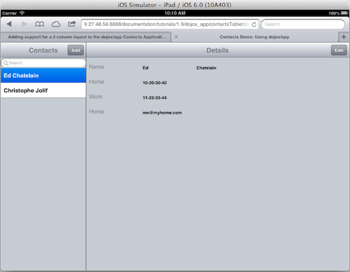
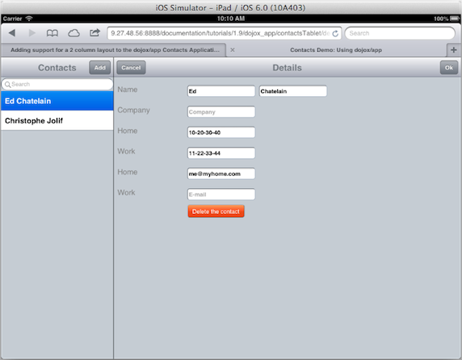

## Updating the Contacts App for a Tablet

In the previous tutorial, [Updating the Contacts App for a Phone](/documentation/tutorials/1.10/dojox_app/contactsPhone/),
we created a Contacts Application with two views, a "list" view and a "details" view.
This tutorial will add support for a tablet form factor in addition to the phone form factor.  On a tablet the Contacts
Application will use a 2 column layout with the "list" view on the left and the "details" view in the center.

### The Views

The previous version of the **Contacts Application** has support for two views, the
**list** view and the **details** view.  In this tutorial we will add support to use a
two column layout when the application is run on a tablet, or a desktop browser which is sized to be larger than a
phone, when the application is loaded.





Since we are using dojox/app and we already have the **Contacts Application** running on a phone, it is easy to update the
application to have it use a two column layout on a tablet.  These updates are needed to use a two column layout:

*   Update the CSS file for the application to use a media query so that the list will be shown on the left and the back button
	hidden when not running on a phone.
*   Update the The JSON configuration file to use the "has" configuration support to set "constraint": "left" for the list
	if we are not on a phone.
*   Update the main module of the application to set the "has" value for "phone" to true or false depending upon the
	size of the window or client.
*   Update the "list" view handle the selection indicator on the list and to also show the "details" view initially
	when not on a phone.

### The CSS file for the application.

Update the **application CSS** (contacts.css) to include a media query which will take effect when not running on a phone:
The CSS media query looks like this:

<!-- highlight: [1,2,7] -->
```css
	@media screen and (min-width: 501px) {
	  	.leftpanel {
	    	width: 250px;
			border-right:1px solid black;
			z-index:100;
		}
		.backButton {
			display: none;
		}
	}
```

### The JSON configuration file

The JSON configuration file (contacts.json) is updated to add the following:

*   The **"has"** check for "!phone" used to set the constraint to "left" for the "list" view when not running on a phone.

<!-- highlight: [6,7,8,9,10] -->
```js
	"views": {
		"list": {
			"controller": "contactsAppTablet/views/list",
			"template": "contactsAppTablet/views/list.html",
			"nls": "contactsAppTablet/nls/list"
			"has": {
				"!phone": {
					"constraint": "left"
				}
			}
		},
```

### The main module of the application

The main module (contacts.js) is updated to define the **has** configuration flag for **phone**.

<!-- highlight: [9,10] -->
```js
	// we use 'define' and not 'require' to workaround Dojo build system
	// limitation that prevents from making of this file a layer if it
	// using 'require'
	define(["dojo/sniff", "dojo/json", "dojox/mobile/common",
		"dojo/text!contactsAppTablet/contacts.json", "dojox/app/main"],
		function(has, json, common, config, Application){

		 has.add("html5history", !has("ie") || has("ie") > 9);
		 has.add("phone", ((window.innerWidth ||
			document.documentElement.clientWidth) <= common.tabletSize));
		 Application(json.parse(config));

	});
```

### The **"list"** view

The **"list" view template** (list.html) is updated to:

*   Add a class named "leftpanel" to the outer div on the list view template.
*   Add a dojo/require for "dojo/has" in order to use "has" in the template.
*   Use !has('phone') for stateful on the EdgeToEdgeStoreList so the selection will be shown when not running on a phone.

<!-- highlight: [1,3,20] -->
```html
<div class="leftpanel mblBackground">
    <script type="dojo/require">
        has: "dojo/has"
    </script>
    <div data-dojo-type="dojox/mobile/Heading"
         data-dojo-props="fixed: 'top'">
        ${nls.contacts}
        <button data-dojo-type="dojox/mobile/ToolBarButton"
                style="position: absolute; right: 0"
                data-dojo-props="target: 'details',
                    transitionOptions: { params: { edit: true } }"
                data-dojo-attach-point="add">${nls.add}</button>
    </div>
    <div data-dojo-type="dojox/mobile/EdgeToEdgeStoreList"
            data-dojo-mixins="dojox/mobile/FilteredListMixin"
            data-dojo-attach-point="contacts"
            data-dojo-props="store: this.loadedStores.contacts,
                labelProperty: 'displayName',
                itemRenderer: this.ContactListItem,
                placeHolder: '${nls.search}', stateful: !has('phone')">
    </div>
</div>
```

The **"list" view controller** (list.js) is updated to:

*   Set **noArrow: !has("phone"),** on ContactListItem to only show the arrow on a phone.
*   Add an **init function**.
	*   The **init function** sets up a listener which is called when an item is added to the contact list. This listener will set
	the "selectedItem" on the list to the item which was just added.
	*   The **init function** also sets up a listener which is called when the "Add" button is pressed, which will call
	"deselectAll" to clear the selection on the list.
*   Add a **beforeActivate function**.
	*   The **beforeActivate function** will call the "app.transitionToView" function to transition to the "details" view when the application is initialized if not running on a phone.

<!-- highlight: [9,22,24,26,30,37,41,44,55] -->
```js
define(["dojo/_base/declare", "dojo/_base/array", "dojo/has",
	"dojox/mobile/ListItem", "dojox/mobile/EdgeToEdgeStoreList",
	"dojox/mobile/FilteredListMixin"],
	function(declare, array, has, ListItem){
	var ContactListItem = declare(ListItem, {
		target: "details",
		clickable: true,
		// we don't get an arrow if we are on a two panes layout (tablet)
		noArrow: !has("phone"),
		postMixInProperties: function(){
			this.inherited(arguments);
			this.transitionOptions = {
				params: {
					"id" : this.id
				}
			}
		}
	});

	return {
		ContactListItem: ContactListItem,
		init: function(){
			var view = this;
			this.contacts.on("add", function(item){
				// select the newly added element
				if(!has("phone")){
					array.some(view.contacts.getChildren(),
						function(child){
							if(child.id == item.id){
								view.contacts.selectItem(child);
							}
							return false;
						}
					);
				}
			});
			this.add.on("click", function(){
				view.contacts.deselectAll();
			});
		},
		beforeActivate: function(){
			// in tablet we want one to be selected each time but list
			// must be completed for that
			if(!has("phone")){
				// check if something is selected
				var selected = array.some(this.contacts.getChildren(),
					function(child){
						return child.get("selected");
					}
				);
				if(!selected && this.contacts.getChildren().length > 0){
					var item = this.contacts.getChildren()[0];
					this.contacts.selectItem(item);
					// transition
					this.app.transitionToView(this.domNode, {
						target: "details",
						params: {
							id: item.id
						}
					});
				}
			}
		}
	};
});
```

### The **"details"** view

The "details" view does not require any changes to move from a phone form factor to a tablet form factor.

[Run the Contacts Application](demos/contactsAppTablet/contacts.html)

[View the contactsAppTablet source on github](https://github.com/edchat/dojox_app_tutorial/tree/master/contactsTablet/demos/contactsAppTablet)

### Conclusion

In this tutorial, we've learned how to update the Contacts Application from supporting only a phone form factor
to add support for a tablet form factor in addition to the phone form factor.  The tablet form factor uses a 2
column layout with the "list" view on the left and the "details" view in the center.

### The dojox/app Contacts Application Series
1.   [Getting Started with dojox/app](../contactsList)
1.   [Updating the Contacts App for a Phone](../contactsPhone)
1.   [Updating the Contacts App for a Tablet](../contactsTablet)
1.   [Using dojox/app Build and Cordova](../contactsCordova)