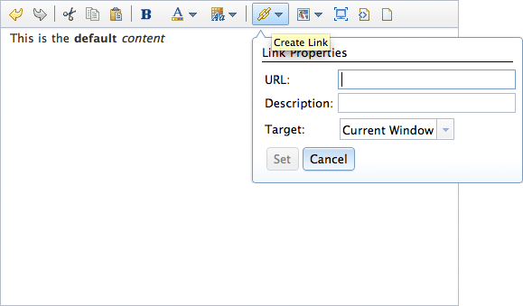
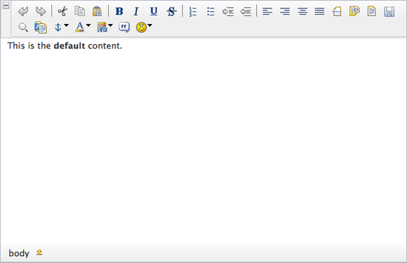

---
Category:  Widgets
...

## Dijit Editor

Dijit's Editor widget is everything a developer looks for in a <abbr title="What You See is What You Get">WYSIWYG</abbr>
editor:  flexible, themeable, and above all, functional.  In this tutorial, you'll learn how to easily implement
`dijit/Editor` (programmatically and declaratively), customize its toolbars, and include Editor plugins from DojoX.

### Getting Started

Sometimes a simple `textarea` for user content will do, but often the user needs more: the ability to make text bold or italic, add links or pictures to the content, or even choose custom color, font, and text size settings.  Popular content management systems like WordPress offer WYSIWYG editors so that creating rich text is easy for anyone.  The Dojo Tookit provides its own WYSIWYG editor widget:  `dijit/Editor`.  The `dijit/Editor` widget provides:

*   Numerous tools you've come to expect from a WYSIWYG editor:  bold, italic, lists, undo/redo, copy/paste, font formatting, and more
*   The ability to configure which tools are available to the user
*   Logic to enable or disable tools as appropriate
*   Easy access to content via `set` and `get` methods
*   A host of advanced plugins available within the `dojox/editor/plugins` space, including:Blockquote, ToolbarLineBreak, Emoticon, Table-centric plugins, and much more

### `dijit/Editor` Properties and Methods

Important `dijit/Editor` properties include:

*   **disabled** - Represents if the Editor should be enabled or disabled
*   **extraPlugins** - An array of extra plugins to be added to the toolbar and available for use within the immediate Editor instance
*   **focusOnLoad** - Represents if the editor should be focused upon loading
*   **name** - Specifies the name of a (hidden) &lt;textarea&gt; node on the page that's used to save the editor content on page leave
*   **plugins** - The list of plugins to be available within the instance by default
*   **toolbar** - The Editor instance's toolbar object
*   **value** - The HTML content within the Editor instance

Important `dijit/Editor` methods include:

*   **addPlugin(pluginName,index)** - Adds a plugin to the editor instance
*   **focus** - Sets focus to the widget instance
*   **get("value")/set("value","content")** - These methods set the HTML content within the editor
*   **redo/undo** - These methods redo and undo recent edit actions

There are lots of important properties and methods but implementing the Dijit Editor is very simple.

[](demo/editor-basic.html)

The basic dijit/Editor instance

### Implementing dijit/Editor

The first step in implementing the Editor widget is the same as any other widget implementation:  loading the Dijit theme and adding its name as a CSS class to the BODY element:

```html
<style type="text/css">
    /* bring in the claro theme */
    @import "//ajax.googleapis.com/ajax/libs/dojo/1.10.3/dijit/themes/claro/claro.css";
</style>
<body class="claro">
```

<!-- protip -->
> The class doesn't actually _have_ to be applied to the BODY element. It can be applied to any element on the page, but only the elements within that one will receive the styling, so it's common to apply to the BODY, to ensure the full page receives the theme's styling.

Once the Dijit theme is in place, the following code snippet is all you need to create an Editor widget instance:

```html
<script src="//ajax.googleapis.com/ajax/libs/dojo/1.10.3/dojo/dojo.js"
    data-dojo-config="async: true, parseOnLoad: true"> </script>
<script>
    // Load the editor resource
    require(["dijit/Editor", "dojo/parser"]);
</script>

<!-- declaratively create an Editor instance -->
<div data-dojo-type="dijit/Editor"></div>
```

[View Demo](demo/editor-basic.html)

While the Editor displays numerous tools by default, it's very easy to choose which tools you'd like displaying and which you'd prefer not be available:

```html
<div data-dojo-type="dijit/Editor"
    data-dojo-props="plugins:['bold','italic','|','cut','copy','paste','|','insertUnorderedList']"></div>

```

[View Demo](demo/editor-custom.html)

For the rest of the tutorial, we'll continue using the declarative approach, but it's quite simple to create one programmatically as well. The attributes that get set in the `data-dojo-props` are just passed through as an object to the constructor, along with a DOM node or an ID of a node to replace with the editor, like so:<p>

```html
<div style="width:700px;min-height:100px;" id="myEditor"></div>
<script>
    // Load the editor resource
    require(["dijit/Editor", "dojo/domReady!"], function(Editor){
        // Make our editor
        var editor = new Editor({
            plugins: ["bold","italic","|","cut","copy","paste","|","insertUnorderedList"]
        }, "myEditor");
        editor.startup();
    });
</script>
```

[View Demo](demo/editor-programmatic.html)

### Using Plugins

An additional set of Editor plugins is available yet within the dijit/_editor/plugins object.  These additional plugins include:

<table class="info">
	<tr>
		<td>**dijit/_editor/plugins/ToggleDir**toggleDir</td>
		<td>**dijit/_editor/plugins/TextColor**foreColor, hiliteColor</td>
	</tr>
	<tr>
		<td>**dijit/_editor/plugins/FontChoice**fontName, fontSize, formatBlock</td>
		<td>**dijit/_editor/plugins/LinkDialog**createLink, insertImage</td>
	</tr>
	<tr>
		<td>**dijit/_editor/plugins/FullScreen**fullscreen</td>
		<td>**dijit/_editor/plugins/ViewSource**viewsource</td>
	</tr>
	<tr>
		<td>**dijit/_editor/plugins/Print**print</td>
		<td>**dijit/_editor/plugins/NewPage**newpage</td>
	</tr>
</table>

<!-- protip -->
> The bolded text represents the resource; the basic text represents the "short name" to be added to the extraPlugins list.

[](demo/editor-dijit-plugins.html)

Dijit Editor with extra plugins

To use these extra plugins, require their resources and add their "short names" to the extraPlugins setting:

```html
<script>
    // Include the class
    require([
        "dijit/Editor",
        "dojo/parser",
        "dijit/_editor/plugins/TextColor",
        "dijit/_editor/plugins/LinkDialog",
        "dijit/_editor/plugins/FullScreen",
        "dijit/_editor/plugins/ViewSource",
        "dijit/_editor/plugins/NewPage"
    ]);
</script>
<div data-dojo-type="dijit/Editor" data-dojo-props="extraPlugins:['foreColor','hiliteColor','|','createLink','insertImage','fullscreen','viewsource','newpage']">
    This is the <strong>default</strong> content.
</div>
```

[View Demo](demo/editor-dijit-plugins.html)

Along with the the host of extra plugins within the `dijit` namespace, `dojox/editor/plugins` provides numerous additional plugins for Editor:

<table class="info">
	<tr><td>**dojox/editor/plugins/PrettyPrint**prettyprint</td>
	<td>**dojox/editor/plugins/PageBreak**pagebreak</td></tr><tr>
	<td>**dojox/editor/plugins/ShowBlockNodes**showblocknodes</td>
	<td>**dojox/editor/plugins/Preview**preview</td></tr><tr>
	<td>**dojox/editor/plugins/Save**save</td>
	<td>**dojox/editor/plugins/ToolbarLineBreak**|| or toolbarlinebreak</td></tr><tr>
	<td>**dojox/editor/plugins/NormalizeIndentOutdent**normalizeindentoutdent</td>
	<td>**dojox/editor/plugins/Breadcrumb**breadcrumb</td></tr><tr>
	<td>**dojox/editor/plugins/FindReplace**findreplace</td>
	<td>**dojox/editor/plugins/PasteFromWord**pastefromword</td></tr><tr>
	<td>**dojox/editor/plugins/InsertAnchor**insertanchor</td>
	<td>**dojox/editor/plugins/CollapsibleToolbar**collapsibletoolbar</td></tr><tr>
	<td>**dojox/editor/plugins/TextColor**foreColor hiliteColor</td>
	<td>**dojox/editor/plugins/Blockquote**blockquote</td></tr>
	<tr>
		<td>**dojox/editor/plugins/Smiley**smiley</td>
		<td>**dojox/editor/plugins/UploadImage**uploadImage</td>
	</tr>
</table>

[](demo/editor-dojox-plugins.html)

Dijit Editor with extra plugins from dojox/editor/plugins

Requiring these resources and adding their short names to the `extraPlugins` array will allow for these plugins to be used within an Editor instance:

```html
<link rel="stylesheet" href="/js/dojox/editor/plugins/resources/css/PageBreak.css" />
<link rel="stylesheet" href="/js/dojox/editor/plugins/resources/css/ShowBlockNodes.css" />
<link rel="stylesheet" href="/js/dojox/editor/plugins/resources/css/Preview.css" />
<link rel="stylesheet" href="/js/dojox/editor/plugins/resources/css/Save.css" />
<link rel="stylesheet" href="/js/dojox/editor/plugins/resources/css/Breadcrumb.css" />
<link rel="stylesheet" href="/js/dojox/editor/plugins/resources/css/FindReplace.css" />
<link rel="stylesheet" href="/js/dojox/editor/plugins/resources/css/PasteFromWord.css" />
<link rel="stylesheet" href="/js/dojox/editor/plugins/resources/css/InsertAnchor.css" />
<link rel="stylesheet" href="/js/dojox/editor/plugins/resources/css/CollapsibleToolbar.css" />
<link rel="stylesheet" href="/js/dojox/editor/plugins/resources/css/Blockquote.css" />
<link rel="stylesheet" href="/js/dojox/editor/plugins/resources/css/Smiley.css" />

<script>
    // Include the class
    require([
        "dijit/Editor",
        "dojo/parser",
        "dojox/editor/plugins/PrettyPrint",
        "dojox/editor/plugins/PageBreak",
        "dojox/editor/plugins/ShowBlockNodes",
        "dojox/editor/plugins/Preview",
        "dojox/editor/plugins/Save",
        "dojox/editor/plugins/ToolbarLineBreak",
        "dojox/editor/plugins/NormalizeIndentOutdent",
        "dojox/editor/plugins/Breadcrumb",
        "dojox/editor/plugins/FindReplace",
        "dojox/editor/plugins/PasteFromWord",
        "dojox/editor/plugins/InsertAnchor",
        "dojox/editor/plugins/CollapsibleToolbar",
        "dojox/editor/plugins/TextColor",
        "dojox/editor/plugins/Blockquote",
        "dojox/editor/plugins/Smiley",
        "dojox/editor/plugins/UploadImage"
    ]);
</script>
<div data-dojo-type="dijit/Editor" style="width:800px;min-height:100px;" data-dojo-props="extraPlugins:['prettyprint','pagebreak','showblocknodes','preview','save','toolbarlinebreak','normalizeindentoutdent','breadcrumb','findreplace','pastefromword','insertanchor','collapsibletoolbar','foreColor', 'hiliteColor','blockquote','smiley','uploadImage']">
    This is the <strong>default</strong> content.
</div>
```

[View Demo](demo/editor-dojox-plugins.html)

<!-- protip -->
> Many of the Editor plugins within the dojox namespace have their own stylesheet, so don't forget to check the `dojox/editor/plugins/resources` folder to see if the given plugin has one. Note that in production, you would typically combine your CSS resources into a single CSS file @import rules, and allow the Dojo build system to combine your CSS files into a single file.

With the number of plugins and functionality baked right into `dijit/Editor`, this widget can match up with, if not surpass, any of the WYSIWYG editors on the web!

### Conclusion

Dijit's Editor widget is a flexible, functional widget that allows users to create richly formatted content.  Editor comes standard with numerous useful tools but provides even more powerful plugins within `dojox/editor/plugins`.  There's no need to look outside of Dojo to find a WYSIWYG editor for your application &mdash; it's already there!

### dijit/Editor Resources

Looking for more detail about Dijit's Editor?  Check out these great resources:

*   [dijit/Editor API Documentation](/api/?qs=1.10/dijit/Editor)
*   [dijit/Editor Reference Guide](/reference-guide/1.10/dijit/Editor.html)
*   [dojox/editor/plugins Reference Guide](/reference-guide/1.10/dojox/editor/plugins.html#dojox-editor-plugins)
*   [dijit/Editor Tests](http://download.dojotoolkit.org/release-1.10.3/dojo-release-1.10.3/dijit/tests/editor/)