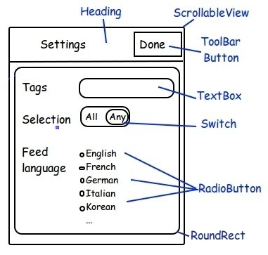
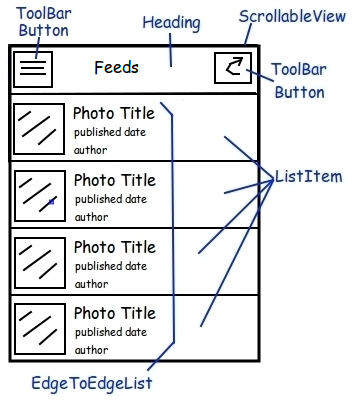
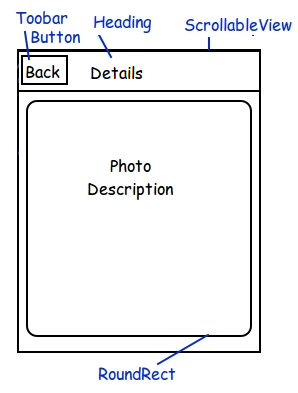
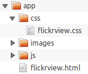
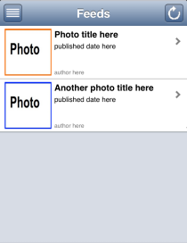
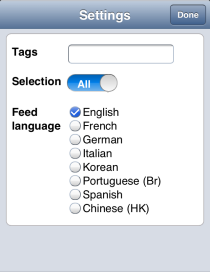
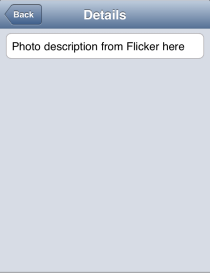

## Part 2 - Developing a Dojo Mobile Application: FlickrView

The first article in our series, [Getting Started with Dojo Mobile](../part1), 
detailed the fundamental concepts and usage of the Dojo Toolkit's `dojox/mobile` library. In the remaining posts in 
this series, we'll embark on creating our own fully functional Dojo Mobile web application called 
**FlickrView**. This post will focus on familiarizing you with what FlickrView is, what we want it to do, and we'll 
get started on building the mobile application's HTML and CSS layout.

### What is FlickrView?

FlickrView is the name of the application we're going to create using Dojo Mobile and a few custom Dojo resources of 
our own. FlickrView won’t simply be a small exercise in using Dojo Mobile; FlickrView will be a useful, fully-functioning 
mobile web application. Our goals for FlickrView are as follows:

*   Utilize Dojo Mobile's widgets to create a cross-device compatible mobile application
*   Add our own custom elements, controls, and functionality to the web application
*   Connect to [Flickr open API](http://www.flickr.com/services/feeds/docs/photos_public/) using
[JSONP](http://dojotoolkit.org/reference-guide/dojo/request/script.html#dojo-request-script) to retrieve public 
photos that match search criteria.

Investing time in brainstorming about the design and architecture of the application before jumping into coding is 
even more critical when creating mobile applications due to the restrictions on bandwidth.

### Application Design and requirements

We’ll be creating FlickrView from the following sketches:



The first view to show up (the default view) is the **Feed view** which displays a list of photos according to search 
criteria. The header contains a button on the left to display the **Settings view**. Another button on the right allows 
to refresh the content of the view. The selection of a list item triggers a transition to the **Details view** with the 
full description of the photo.

Settings view options will be derived from 
[Flickr public feed JSON query parameters:](http://www.flickr.com/services/feeds/docs/photos_public/)

*   **tags** - defines the_tags_ query parameter
*   **selection** - defines the_tagmode_ query parameter
*   **feed language** - defines the_lang_ query parameter. The list of languages conforms to 
[Flickr accepted languages values.](http://www.flickr.com/services/feeds/)

Published date, author, and photo description will result from the JSON request. Will go through this in detail later on.

### Mobile Development Guidelines

Hold up! Before we jet off into coding FlickrView, there are a few things we need to remember about Dojo Mobile and 
mobile web development in general:

*   **Size Matter**<br>
Every byte counts when it comes to creating mobile applications, so taking shortcuts you wouldn't otherwise take in a 
standard web app is acceptable. Remember that every dependency (in the form of Dojo classes, base or otherwise) you add 
increases download time to your users.
*   **Best Practices: Mobile != Web**<br>
Best practices for JavaScript and any JavaScript toolkit dictate certain best practices. A few examples include not 
extending natives, not using global variables, and creating very flexible/generic classes. These best practices can 
cost you lots of extra code, so you may have to loosen your rules to create an efficient mobile app.
*   **Keep It Simple**<br>
Creating an overly complex mobile application with a million custom styles and widgets and layouts will get you in 
trouble quickly. Creating a simple layout, then adding to it, is the optimal way to code mobile web applications.

We **will not** be throwing all best practices out the door with FlickrView. We will, however, find a solid balance 
of size savings vs. strict Dojo best practices.

### Organizing your project



The application HTML will be at the root level and JavaScript, images and stylesheets living in dedicated directories.

We choose to name our application HTML file `flickrview.html` and put its CSS resources in `css/flickrview.css`. 
We will add images and javascript resources later.

### Mobile Devices and Caching

Most mobile devices rely heavily on caching to ease the burden of data transfer. That's great for production apps 
but we're in the initial development phase so caching will be nothing short of frustrating when testing the 
application. Let's add a few cache-preventing META tags to our HTML page before developing the Settings view:

```html
<!-- prevent cache -->
<meta http-equiv="cache-control" content="no-cache">
<meta http-equiv="pragma" content="no-cache">
```

These META tags will be hugely helpful during development. They will need to be removed once TweetView goes into production.

### FlickrView HTML structure

The first part, [Getting Started with Dojo Mobile](../part1), provided a solid Dojo Mobile application template 
with the required theme stylesheet and SCRIPT tags from which to start from.

Here is now how should look our HTML before we define the three Views (SettingsView, FeedView and DetailsView):

```html
<!DOCTYPE html>
<html>
<head>
	<meta http-equiv="Content-type" content="text/html; charset=utf-8"/>
	<meta name="viewport" content="width=device-width,initial-scale=1,maximum-scale=1,minimum-scale=1,user-scalable=no"/>
	<meta name="apple-mobile-web-app-capable" content="yes"/>
	<!-- prevent cache -->
	<meta http-equiv="cache-control" content="no-cache">
	<meta http-equiv="pragma" content="no-cache">
	<title>Dojo Mobile tutorial | Flickrview | Part II | HTML Structure</title>
	<!-- application stylesheet -->
	<link rel="stylesheet" type="text/css" href="css/flickrview.css">
	<!-- dynamically apply native visual theme according to the browser user agent -->
	<script type="text/javascript" src="//ajax.googleapis.com/ajax/libs/dojo/1.10.3/dojox/mobile/deviceTheme.js"></script>
	<!-- dojo configuration options -->
	<script type="text/javascript">
		dojoConfig = {
			async: true,
			baseUrl: './',
			parseOnLoad: false,
			mblHideAddressBar: true,
			packages: [{
				name: "flickrview",
				location: "js"
			}]
		};
	</script>
	<!-- dojo bootstrap -->
	<script type="text/javascript" src="//ajax.googleapis.com/ajax/libs/dojo/1.10.3/dojo/dojo.js"></script>
	<!-- dojo application code -->
	<script>
		// Load the widget parser and mobile base
		require([
			"dojox/mobile/parser",
			"dojox/mobile/compat",
			"dojo/domReady!"
		], function (parser) {
			// Parse the page for widgets
			parser.parse();
		});
	</script>
</head>
<body style="visibility:hidden;">
	 application will go here
</body>
</html>
```

With this template in place, let's focus on putting together all our views: FeedView, SettingsView and DetailsView:

    

#### Feed View

```html
<!-- Feed view -->
<div id="feed" data-dojo-type="dojox/mobile/ScrollableView" data-dojo-props="selected: true">
<div id="feedHeading"
	 data-dojo-type="dojox/mobile/Heading"
	 data-dojo-props="fixed: 'top', label: 'Feeds'">
			<span data-dojo-type="dojox/mobile/ToolBarButton"
				  data-dojo-props="icon: 'images/settings.png', moveTo:'settings', transitionDir:'-1', transition:'none'"
				  style="float:left;"></span>
			<span id="refreshButton" data-dojo-type="dojox/mobile/ToolBarButton"
				  data-dojo-props="icon: 'images/refresh.png'"
				  style="float:right;"></span>
</div>
<div id="feedList" data-dojo-type="dojox/mobile/EdgeToEdgeList">
	<div data-dojo-type="dojox/mobile/ListItem"
		 data-dojo-props="moveTo:'details', transition:'slide'" class="photoListItem">
		
		<div class="photoSummary">
			<div class="photoTitle">Photo title here</div>
			<div class="publishedTime" data-dojo-time="2013-12-13">published date here</div>
			<div class="author">author here</div>
		</div>
		<div class="summaryClear"></div>
	</div>
	<div data-dojo-type="dojox/mobile/ListItem"
		 data-dojo-props="moveTo:'details', transition:'slide'" class="photoListItem">
		
		<div class="photoSummary">
			<div class="photoTitle">Another photo title here</div>
			<div class="publishedTime" data-dojo-time="2013-12-13">published date here</div>
			<div class="author">author here</div>
		</div>
		<div class="summaryClear"></div>
	</div>
</div>
</div>
```
#### Settings View

```html
<!-- Settings view -->
<div id="settings" data-dojo-type="dojox/mobile/ScrollableView">
<div data-dojo-type="dojox/mobile/Heading"
	 data-dojo-props="fixed: 'top', label: 'Settings'">
	  <span id="doneButton" data-dojo-type="dojox/mobile/ToolBarButton"
			data-dojo-props="label:'Done', moveTo:'feed', transition:'none'" style="float:right;"></span>
</div>
<div data-dojo-type="dojox/mobile/RoundRect">
	<div data-dojo-type="dojox/mobile/FormLayout"
		 data-dojo-props="columns:'two'">
		<div>
			<label for="tags">Tags</label>
			<fieldset>
				<input type="text" id="tags" data-dojo-type="dojox/mobile/TextBox"
					   data-dojo-props="value:''">
			</fieldset>
		</div>
		<div>
			<label for="select">Selection</label>
			<fieldset>
				<input type="checkbox" id="select" data-dojo-type="dojox/mobile/Switch"
					   value="on" leftLabel="All" rightLabel="Any">
			</fieldset>
		</div>
		<div>
			<label>Feed language</label>
			<fieldset>
				<input id="en-us" data-dojo-type="dojox/mobile/RadioButton" checked
					   type="radio" name="feedLanguage" value="en-us"><label for="en-us">English</label><br />
				<input id="fr-fr" data-dojo-type="dojox/mobile/RadioButton"
					   type="radio" name="feedLanguage" value="fr-fr"><label for="fr-fr">French</label><br />
				<input id="de-de" data-dojo-type="dojox/mobile/RadioButton"
					   type="radio" name="feedLanguage" value="de-de"><label for="de-de">German</label><br />
				<input id="it-it" data-dojo-type="dojox/mobile/RadioButton"
					   type="radio" name="feedLanguage" value="it-it"><label for="it-it">Italian</label><br />
				<input id="ko-kr" data-dojo-type="dojox/mobile/RadioButton"
					   type="radio" name="feedLanguage" value="ko-kr"><label for="ko-kr">Korean</label><br />
				<input id="pt-br" data-dojo-type="dojox/mobile/RadioButton"
					   type="radio" name="feedLanguage" value="pt-br">
					   <label for="pt-br">Portuguese (Br)</label><br />
				<input id="es-us" data-dojo-type="dojox/mobile/RadioButton"
					   type="radio" name="feedLanguage" value="es-us"><label for="es-us">Spanish</label><br />
				<input id="zh-hk" data-dojo-type="dojox/mobile/RadioButton"
					   type="radio" name="feedLanguage" value="zh-hk">
					   <label for="zh-hk">Traditional Chinese (HK)</label><br />
			</fieldset>
		</div>
	</div>
</div>
</div>
```
#### Details View

```html
<!-- Details view -->
<div id="details" data-dojo-type="dojox/mobile/ScrollableView">
<div id="detailsHeading" data-dojo-type="dojox/mobile/Heading"
	 data-dojo-props="fixed: 'top', label: 'Details', back:'Back', moveTo:'feed', transition:'slide', transitionDir:'-1'">
</div>
<div id="detailsContainer" data-dojo-type="dojox/mobile/RoundRect">
	Photo description from Flicker here
</div>
</div>
```

Note that content is static. Getting content from Flickr is covered in the next part of this series:
[FlickrView: Implementing FeedView](../part3).

*   Instead of using the widget **dojox/mobile/View **, we have choose to use **dojox/mobile/ScrollableView**. 
ScrollableView allows the header to be fixed to the top of the view while the content will scroll. It is particularly 
well adapted for small screen devices or when the view contains an undetermined number of items.
*   The header is rendered by the widget **dojox/mobile/Heading **. We also added **dojox/mobile/ToolBarButton** widgets:

*    will refresh the content of the_Feed_ view
*    transitions to the_Settings_view
*    transition to the_Feed_ view
*    transition back to the_Feed_ view

*   Note the attribute **data-dojo-props** of **ToolBarButton**: refresh and settings buttons are rendered using 
images we put in our images directory, and declared in the_icon_ property.
*   Also, note how transitions are declared in **data-dojo-props**.`moveTo` defines the target,`transition` defines 
the type of transition and`transitionDir` defines the direction of the transition. See
[dojox/mobile/heading](http://dojotoolkit.org/reference-guide/dojox/mobile/Heading.html) for more details.
*   On the _Feed_ view we declared 2 **dojox/mobile/ListItem** widgets for the sake of the mockup. Eventually we will 
programmatically generate ListItems from the result of a JSONP request.
*   Custom CSS are used only to format the ListItem. All other formatting styles are already provided by Dojo Mobile theme.

As usual, do not forget to require the widgets you declared in your HTML:

```js
require([
	//...
	"dojox/mobile/ScrollableView",
	"dojox/mobile/ListItem",
	"dojox/mobile/FormLayout",
	"dojox/mobile/TextBox",
	"dojox/mobile/RadioButton",
	"dojox/mobile/Heading",
	"dojox/mobile/EdgeToEdgeList",
	"dojox/mobile/RoundRect",
	"dojox/mobile/Switch"
], function (parser) {
	//...
});
```

Our application layout is now complete!

[View Demo](demo/mockup2.html)

### FlickrView Has Taken Shape!

Creating the basic layout of FlickrView was simple: add ScrollingView and ToolBar widgets. I'd like to point out that 
every pieces of our application is currently included within dojox/mobile: Headings, Toolbars, TextBox… they're all 
there to be quickly implemented!

Now we want to extend ScrollableView to specialize our views:

*   Settings view to display the current settings and update flickrview.QUERY according to user inputs
*   Feed view to be in charge of getting data from Flickr and display the result.

#### Extending ScrollableView

First we define our classes by creating skeletons files `js/FeedView.js` and `js/SettingsView.js`:

```js
define([
	"dojo/_base/declare",
	"dojox/mobile/ScrollableView"
	], function(declare, ScrollableView){
		return declare([ScrollableView], {
	});
});
```

Now we can update the HTML attributes **data-dojo-type** to use the new classes:

```html
<!-- Feed view -->
<div id="feed" data-dojo-type="flickrview/FeedView"

<!-- Settings view -->
<div id="settings" data-dojo-type="flickrview/SettingsView">
```

In the meantime we must require our classes name to ensure the parser loads them:

```js
require([
	//...
	"flickrview/FeedView",
	"flickrview/SettingsView"
	], function (parser) {
		//...
});
```

**Congratulation!** Our mock application now uses dedicated classes for the feed and settings view.

In this part we introduced the mobile application we are building with Dojo Mobile: FlickrView. 
Starting from the application design and requirements, we built the general layout template and came up with a mockup 
of the application. We also talked about best practices and we extended ScrollableView so we are now ready to implement 
FlickrView to make it work as expected!

Looking forward to the next part in our FlickrView series, where we will implement FeedView to dynamically:

*   Get feeds from Flickr with **dojo/request/script**.
*   Build a list of customized **dojox/mobile/ListItem**.

### Download The Source

Download [Part 2 - Developing a Dojo Mobile Application: FlickrView](resources/DojoMobilePart2.zip).

### Resources & references

*   [Dojo Mobile Reference Guide](http://dojotoolkit.org/reference-guide/dojox/mobile.html)
*   [The Dojo Toolkit API](http://dojotoolkit.org/api)
*   [Dojo Request Script/JSONP](http://dojotoolkit.org/reference-guide/dojo/request/script.html#dojo-request-script) (Reference Guide)
*   [dojox/mobile Heading](http://dojotoolkit.org/reference-guide/dojox/mobile/Heading.html) (Reference Guide)

### The FlickrView Series

* [Part 1 - Getting Started with Dojo Mobile](../part1/)
* [Part 2 - Developing a Dojo Mobile Application: FlickrView](../part2/)
* [Part 3 - FlickrView: Implementing FeedView](../part3/)  
* [Part 4 - FlickrView: Implementing SettingsView](../part4/)
* [Part 5 - Build FlickrView for production](../part5/)